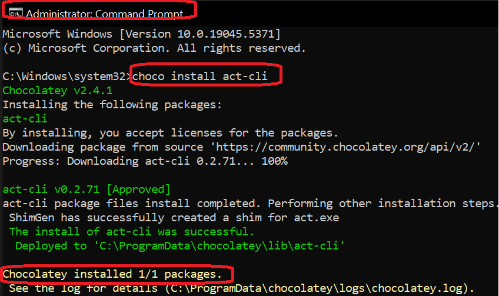
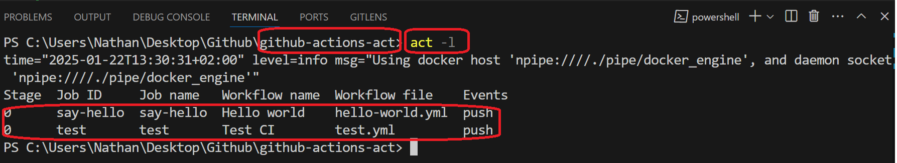

<h1>Project Name</h1>
Run GitHub Actions Locally with act


<h2>Project Description</h2>
Introduction to act , workflows and running them locally

<h2>Motivation</h2>

You start developing the workflow and want to check that it is working correctly. However, you have several constraints:

  <ul>
    <li><strong>Fast Feedback</strong>: Rapidly identify and resolve issues locally, accelerating the development cycle.</li>
    <li><strong>Reduced GitHub Pollution</strong>: Avoid unnecessary workflow runs and clutter in your repository's history.</li>
    <li><strong>Cost Control</strong>: Eliminate GitHub Actions usage costs by running workflows locally.</li>
  </ul>


The solution is to run it locally using nektos/act. But how do you do it? That's the motivation for this repo

<h2>How does act work</h2>
When you run act it reads in your GitHub Actions from .github/workflows/ and determines the set of actions that need to be run. It uses the Docker API to either pull or build the necessary images, as defined in your workflow files and finally determines the execution path based on the dependencies that were defined. Once it has the execution path, it then uses the Docker API to run containers for each action based on the images prepared earlier. The environment variables and filesystem are all configured to match what GitHub provides.

<h2>Installation</h2>

<a href='https://nektosact.com/installation/index.html'>prerequisites for running act</a> this actually includes

<ul>
<li>install docker . i am using Windows 10 , so installed docker desktop <a href='https://docs.docker.com/desktop/setup/install/windows-install/'>here</a>)</li>
<li>install act , follow <a href='https://nektosact.com/installation/index.html'>this</a> 
i will use chocolatey which is a packager manager for windows <a href='https://nektosact.com/installation/chocolatey.html'>here</a> 

make sure you run the following as administrator

```bash
choco install act-cli
```
This image show the results of the above command on my windows 10 machine 


remark : You can also use winget which is part of Windows 10 as of version 1809


</li>
</ul>

<h2>Usefull act Comands</h2>

<h3>run all workflow file</h3>

```bash
act
```

<h3>run specific workflow job</h3>

```bash
act -j job_name
```

<h3>run specific workflow file</h3>

```bash
act -w .github/workflows/your-workflow-file.yml
```

<h3>get act version</h3>

Following this you can check act installation using

```bash
act --version
```

<h3>get act help</h3>

```bash
act --help
```

<h3>list all workflow jobs</h3>
When you invoke act inside a project with workspace 

```bash
act -l
```

it will list the workflows files as shown in the following image




<h2>Technologies Used</h2>
nektos/act
docker


<h2>Demo</h2>
run like in files 1,2,3 and copy output


<h2>Points of Interest</h2>
<ul>
    <li>in short why docker --> as runner</li>
   <li>Manage and Run Act Directly From VS Code! : check <a href='https://sanjulaganepola.github.io/github-local-actions-docs/'>here</a> it is recommended by act <a href='https://github.com/nektos/act'>docs</a></li>
</ul>

<h2>References</h2>
<ul>
    <li><a href='https://github.com/nektos/act'>GitHub repository for act</a></li>
    <li><a href='https://youtu.be/x239z6DdE0A?si=Y0pzO1AkyiMUoe-T'> Introduction to GitHub Actions: Learn Workflows with Examples </a></li>
</ul>

