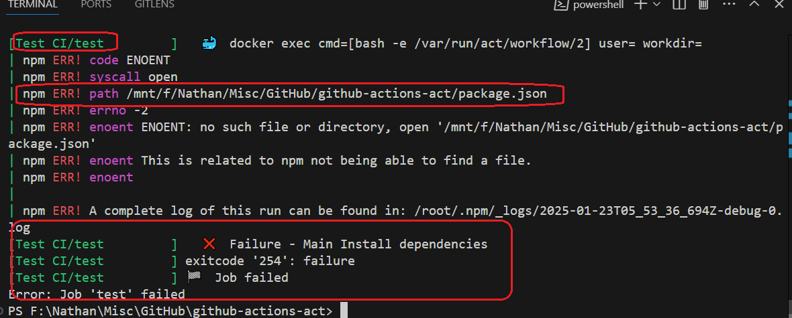
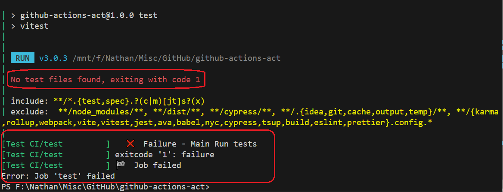
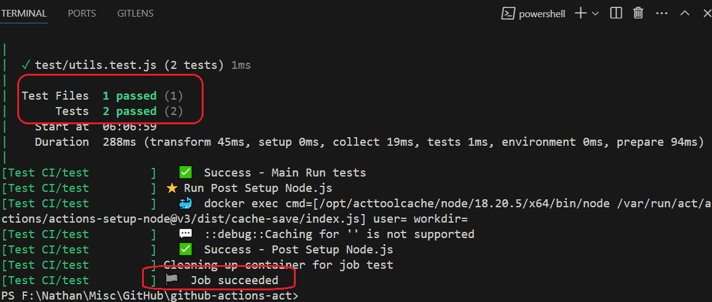

<h1>Project Name</h1>
Run <code>GitHub Actions</code> Locally with <code>nektos/act</code>


<h2>Project Description</h2>
This project has two simple <code>workflow</code> files .It explains how to 
run them locally using <code>act</code> 

<h2>Motivation</h2>

You start developing the <code>workflow</code> and want to check that it is 
working correctly. However, you have several constraints:

  <ul>
    <li><strong>Fast Feedback</strong>: Rapidly identify and resolve issues locally,
     accelerating the development cycle.</li>
    <li><strong>Reduced GitHub Pollution</strong>: Avoid unnecessary 
    <code>workflow</code> runs and clutter in your repository's history.</li>
    <li><strong>Cost Control</strong>: Eliminate <code>GitHub Actions</code> 
    usage costs by running <code>workflow</code>s locally.</li>
  </ul>


The solution is to run it locally using <code>nektos/act</code> 
But how do you do it? That's the motivation for this repo

<h2>How does <code>act</code> work</h2>
<p>When you run <code>act</code>, it reads in your <code>GitHub Actions</code>
 from .github/workflows/ and determines the set of actions that need to be run.
  It uses the <code>Docker</code> API to either pull or build the necessary images, 
  as defined in your <code>workflow</code> files, and finally determines the
   execution path based on the dependencies that were defined</p>

<p>Once it has the execution path, it then uses the <code>Docker</code> API to run 
containers for each action based on the images prepared earlier. The environment 
variables and filesystem are all configured to match what GitHub provides</p>


<h2>Installation</h2>

<p><a href='https://nektosact.com/installation/index.html'>Prerequisites for running <code>act</code></a> include:</p>

<ul>
<li>Install <code>Docker</code> . I am using Windows 10 , so I installed 
<code>Docker Desktop</code> 
<a href='https://docs.docker.com/desktop/setup/install/windows-install/'>here</a></li>
<li>Install <code>act</code> , 
following <a href='https://nektosact.com/installation/index.html'>this guide</a> 
i used chocolatey which is a package manager for Windows 
<a href='https://nektosact.com/installation/chocolatey.html'>here</a> 

Make sure you run the following as administrator

```bash
choco install act-cli
```

This image show the results of the above command on my Windows 10 machine 

</li>
</ul>

<h2>Remarks</h2>
<ul>
    <li>You can also use <code>winget</code> to install <code>act</code>. 
    It is part of Windows 10 as of version 1809.</li>
    <li>Notice that although this project uses the <code>vitest</code> package, 
    installing it was not mentioned here because it is installed by the runner.</li>
</ul>


<h2>Usage</h2>
The following are useful <code>act</code> commands :

<h3>Run all <code>workflow</code> file</h3>

```bash
act
```

<h3>Run specific <code>workflow</code> job</h3>

```bash
act -j job_name
```

<h3>Run specific <code>workflow</code> file</h3>

```bash
act -w .github/workflows/your-workflow-file.yml
```

<h3>Show <code>act</code> version</h3>

Following this you can check <code>act</code> installation using

```bash
act --version
```

<h3>Show <code>act</code> help</h3>

```bash
act --help
```

<h3>List all <code>workflow</code> jobs</h3>
When you invoke <code>act</code> inside a project with workspace 

```bash
act -l
```

It will list the <code>workflow</code> files as shown in the following image


<h2>Technologies Used</h2>
<ul>
<li><code>nektos/act</code></li>
<li><code>Docker</code></li>
<li><code>vitest</code></li>
</ul>

<h2>Demo</h2>
<p>Make sure Docker is running. You can simply start Docker Desktop.</p>

<h3>First Run</h3>
<p>Run the project without the <code>package.json</code> file and 
without the <code>src</code> and <code>test</code> directories.</p>

<p>The following image shows the failure of the test job. Without 
<code>package.json</code>, the runner does not know which packages to install while running the <code>test.yml</code> workflow file.</p>


<p>The output of the run appears in the file <code>act_run_1.txt</code> 
under the <code>logs</code> folder. Verify yourself that the <code>say-hello</code>
 job is successful.</p>

<h3>Second Run</h3>
<p>Run the project with the <code>package.json</code> file but 
without the <code>src</code> and <code>test</code> directories.</p>

<p>The following image shows the failure of the test job. 
Without the <code>test</code> directory, the runner cannot invoke the test job.</p>


<p>The output of the run appears in the file <code>act_run_2.txt</code> under the <code>logs</code> folder. Verify yourself that the test job failed.</p>

<h3>Third Run</h3>
<p>Run the project with the <code>package.json</code> file and with 
the <code>src</code> and <code>test</code> directories.</p>

<p>The following image shows the success of the tests and the test job.</p>


<p>The output of the run appears in the file <code>act_run_3.txt</code> under the <code>logs</code> folder. Verify yourself that the <code>test</code> job and <code>say-hello</code> jobs are successful.</p>


<h2>Demo</h2>
Make sure the docker is running , simply run the docker desktop 

<h3>First run</h3>
Run without package.json file and without directories src , test

<p>The following image show the failure of the test job because without package.json the runner does not know which packages to install while running the test.yml workflow file</p>


The output of the run appears in the file act_run_1.txt under logs folder. Check yourself here that the say-hello job is success

<h3>Second run</h3>
Run with package.json file but without src and test directories 

The following image show the failure of the test job because without test directory the runner can not invoke the test job 


The output of the run appears in the file act_run_2.txt under logs folder. Check yourself here that the test job is a failure


<h3>Third run</h3>
Run with package.json file and with src and test directories 

The following image show the success of the tests and the test job


The output of the run appears in the file act_run_3.txt under logs folder. Check yourself here that the test job and say-hello jobs are success

<h2>Points of Interest</h2>
<ul>
    <li><strong>Why is <code>Docker</code> used in <code>act</code></strong> : 
    <code>GitHub Actions</code> has a runner, which is a server that 
    processes the <code>workflows</code> jobs. <code>Docker</code> provides an 
    isolated environment that the runner can use, ensuring consistency and 
    proper configuration</li>
   <li><strong>Manage and Run Act Directly From VS Code!</strong> : 
   Check <a href='https://sanjulaganepola.github.io/github-local-actions-docs/'>here</a>
    it is recommended by <code>act</code> 
    <a href='https://github.com/nektos/act'>docs</a></li>
</ul>

<h2>References</h2>
<ul>
    <li><a href='https://github.com/nektos/act'>GitHub repository for <code>act</code></a></li>
    <li><a href='https://youtu.be/x239z6DdE0A?si=Y0pzO1AkyiMUoe-T'> Introduction to <code>GitHub Actions</code>: Learn Workflows with Examples </a>. Here we have same worflows as in this repo</li>
</ul>

